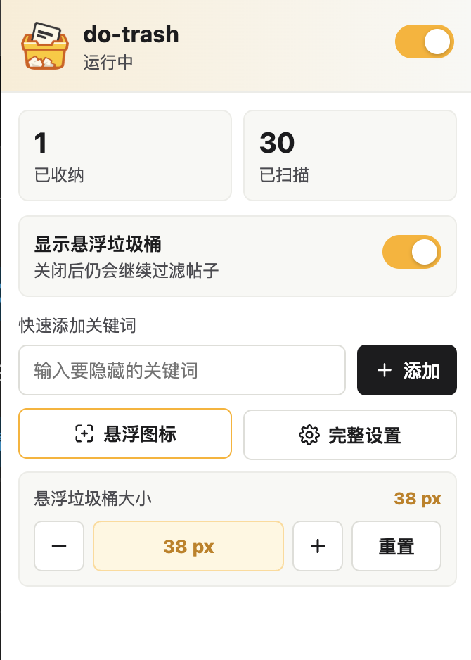
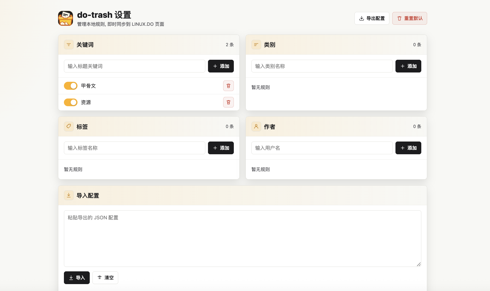
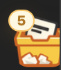

<div align="center">
  

  <h1>do-trash</h1>

  <p><strong>面向 LINUX.DO 的本地帖子过滤与垃圾桶扩展</strong></p>
  <p>把列表页和搜索页中命中规则的帖子隐藏到页面悬浮垃圾桶, 保持浏览列表更清爽.</p>

  <p>
    
    
    
    
  </p>
</div>

## 功能

- 按关键词, 类别, 标签, 作者过滤 LINUX.DO 帖子
- 支持首页, 列表页和搜索页的帖子隐藏
- 命中规则的帖子会进入当前页面的悬浮垃圾桶
- 垃圾桶支持拖拽, 自动贴边, 计数角标和展开面板
- 可在插件弹窗里显示或隐藏悬浮垃圾桶, 并快速调整悬浮图标大小
- 支持单条还原和当前页全部还原
- 支持 Chrome 和 Firefox WebExtension 版本
- 配置保存在浏览器本地, 不上传任何数据

## 截图

### 插件弹窗


### 悬浮图标调整



### 完整设置



### 页面悬浮垃圾桶



### 当前页垃圾桶面板


## 安装

### Chrome

1. 从 Release 下载 `do-trash-v0.2.0-chrome.zip` 并解压.
2. 打开 Chrome 扩展管理页: `chrome://extensions`.
3. 开启右上角"开发者模式".
4. 点击"加载已解压的扩展程序".
5. 选择解压后的 `do-trash-v0.2.0-chrome` 文件夹.

### Firefox

1. 从 Release 下载 `do-trash-v0.2.0-firefox.zip` 并解压.
2. 打开 Firefox 调试页: `about:debugging#/runtime/this-firefox`.
3. 点击"临时载入附加组件".
4. 选择解压后的 `do-trash-v0.2.0-firefox/manifest.json`.

Firefox 临时载入适合测试反馈, 当前 Firefox 构建要求 Firefox 140+; 正式长期安装需要 AMO 或签名后的 `.xpi`.

## 使用

### 快速添加关键词

点击浏览器工具栏里的 do-trash 图标, 在弹窗中输入关键词并添加. 新规则会立即同步到已打开的 LINUX.DO 页面.

### 悬浮垃圾桶开关

点击浏览器工具栏里的 do-trash 图标, 可以控制是否显示页面悬浮垃圾桶. 关闭后过滤仍会继续生效, 页面只是不再展示垃圾桶入口和已隐藏列表.

### 完整设置

点击弹窗中的"完整设置", 可以管理:

- 关键词
- 类别
- 标签
- 作者
- 配置导入与导出

### 页面垃圾桶

页面右侧会显示悬浮垃圾桶:

- 拖动后松手自动贴边
- 点击展开当前页已隐藏帖子
- 点击"还原"恢复单条帖子
- 点击顶部恢复按钮恢复当前页全部帖子
- 如果已关闭悬浮垃圾桶, 可以在插件弹窗中重新打开后再进行还原操作

## 规则说明

| 规则 | 匹配内容 |
| --- | --- |
| 关键词 | 帖子标题 |
| 类别 | LINUX.DO 帖子类别 |
| 标签 | 帖子标签 |
| 作者 | 发帖或展示在列表中的用户 |

## 权限说明

| 权限 | 用途 |
| --- | --- |
| `storage` | 保存本地规则, UI 设置和当前统计 |
| `https://linux.do/*` | 只在 LINUX.DO 页面注入过滤逻辑 |

## 本地开发

本项目是原生 Manifest V3 WebExtension, 根目录可直接作为 Chrome 开发目录加载. Firefox 版本通过构建脚本生成到 `dist/`, 构建产物不进入源码树.

常用校验:

```bash
node --check compat.js
node --check content.js
node --check popup.js
node --check options.js
node --check scripts/build.mjs
node -e 'JSON.parse(require("fs").readFileSync("manifest.json", "utf8")); JSON.parse(require("fs").readFileSync("manifest.firefox.json", "utf8")); console.log("manifest ok")'
node scripts/build.mjs
```

## 仓库结构

- `manifest.json`: Chrome 扩展清单
- `manifest.firefox.json`: Firefox 扩展清单
- `compat.js`: Chrome/Firefox 扩展 API 兼容层
- `content.js`: LINUX.DO 页面注入脚本, 负责扫描, 过滤和悬浮垃圾桶
- `popup.html` / `popup.js`: 浏览器工具栏弹窗
- `options.html` / `options.js`: 完整设置页
- `assets/`: 扩展图标, 悬浮图标和 README 截图资源
- `scripts/build.mjs`: 生成 Chrome 和 Firefox 发布包

## 友情链接

- [LINUX DO](https://linux.do) 社区文化: 真诚, 友善, 团结, 专业, 共建你我引以为荣之社区

## 免责声明

本项目为个人使用的非官方浏览器扩展, 与 LINUX.DO 官方无关联. 请尊重社区规则与他人内容, 仅将本扩展用于个人浏览体验整理.
